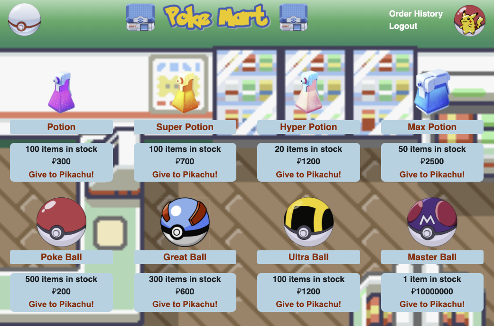

<h1 align="center">Welcome to Poke Mart 🏬</h1>
<p>
  
</p>
 
 ### Description 
 
 This project showcases a full stacked React e-commerce app with the ability to create a user, shop for different items both on the home page and on an individual page, add items to a cart, and checkout.
___
### 🏠 [Homepage](https://poke-mart.herokuapp.com/)



---

### :hammer: Built with

- **React** - React is an open-source, front end, JavaScript library for building user interfaces or UI components. React can be used as a base in the development of single-page or mobile applications.
- **Node.js** - an open-source, cross-platform, JavaScript runtime environment that executes JavaScript code outside a web browser.
- **Express.js** - a web application framework for Node.js. It is designed for building web applications and APIs.
- **Bootstrap** - Extensive list of components and Bundled Javascript plugins.
- **Stripe** - Stripe Payments is a payment processing platform. It allows you to transfer money from a customer's bank account into your business's account by way of a credit or debit card transaction.
- **GraphQL** - An open-source data query and manipulation language for APIs, and a runtime for fulfilling queries with existing data.

---

### Install

```bash
  npm install
```

---

### Usage

```bash
  npm run start
```

---

### Author

👤 **Leo Ayala**

- Portfolio: https://leo-ayala.github.io/Portfolio/
- Github: [leo-ayala](https://github.com/leo-ayala)
- LinkedIn: [Leo Ayala](https://www.linkedin.com/in/leo-ayala-36b333l58/)

---

### 📝 License

Copyright © 2020 [Leo Ayala](https://github.com/leo-ayala).<br />
